# Laporan Jobsheet 2 Minggu ke-2

#### Nama  : Muhammad Daviq Naufal Haqqul Adam
#### NIM   : 254107020010
#### Kelas : TI-1H

## Langkah-langkah Keseluruhan

### 1. Penggunaan `lscpu`
-
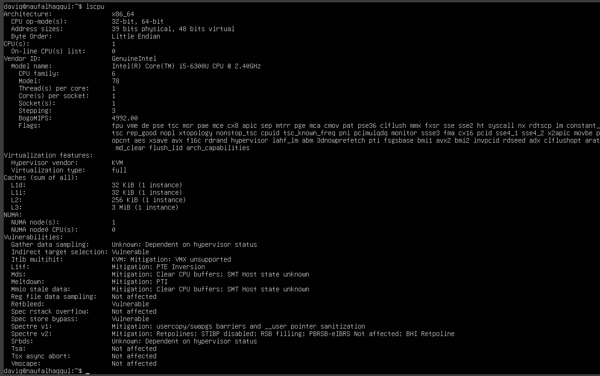

### 2. Langkah Tampilan Ringkasan memori

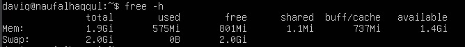

### 3. Langkah cek informasi hardware dari DMI/BIOS (butuh sudo)

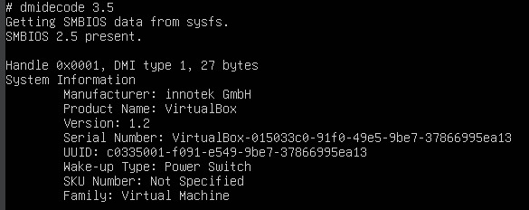

## Langkah-langkah 2.2

### 1. Penggunaan lspci
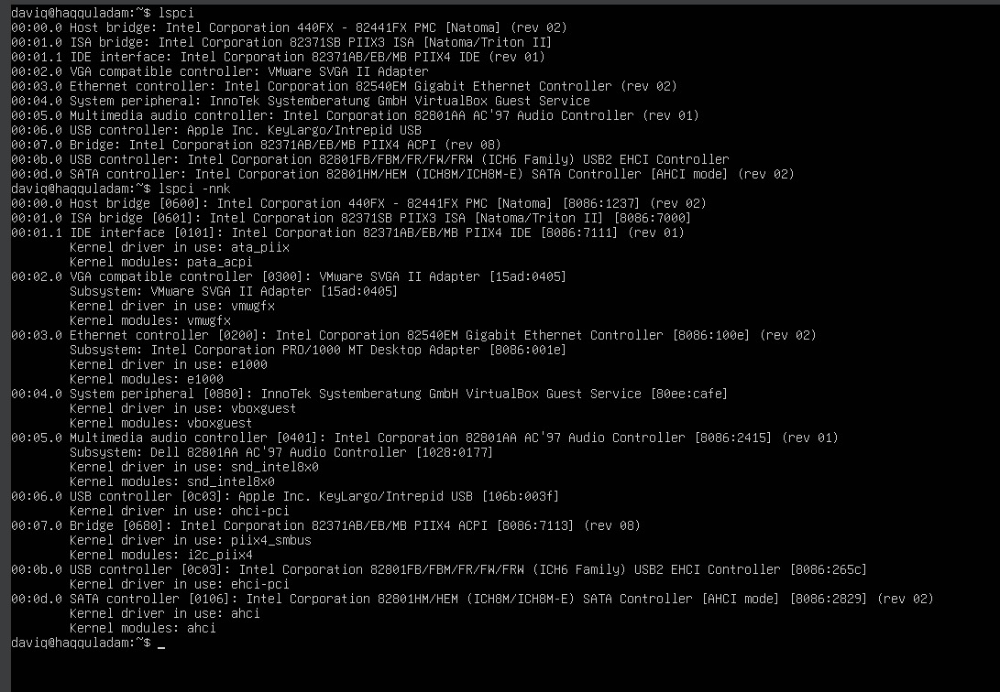

### 2. penggunaan lspci - nnk
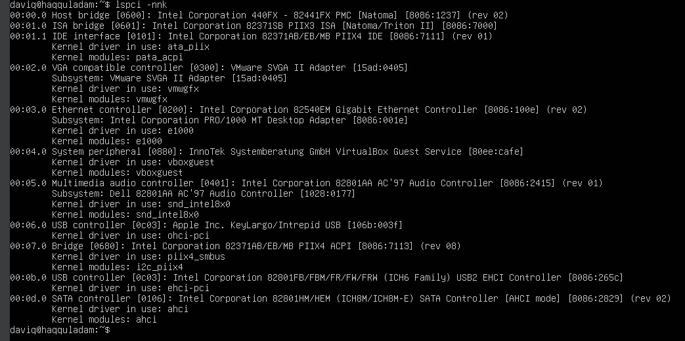

### 3. penggunaan Fokus pada NIC
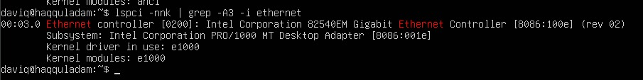

### 4. Melihat USB
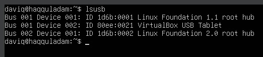

### 5. Melihat Topologi USB
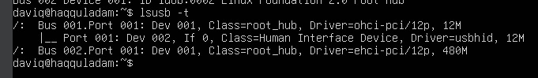

## Langkah-langkah 2.3
 
### 1. Lihat daftar disk/partisi
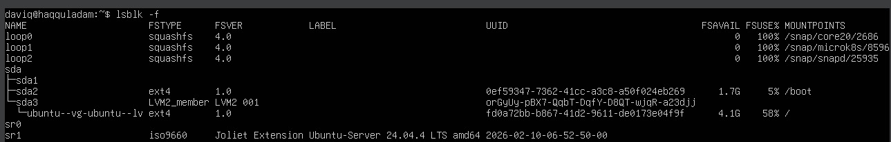

### 2. Tampilkan UUID dan tipe filesystem
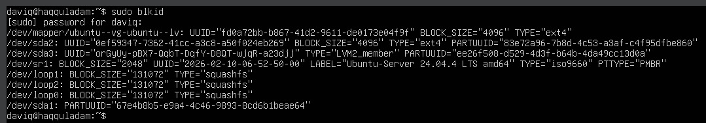

### 3. Lihat mount point untuk root filesystem:
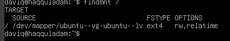

## Langkah-langkah 2.4

### 1. Melihat versi kernel, daftar modul aktif, dan mengecek info modul
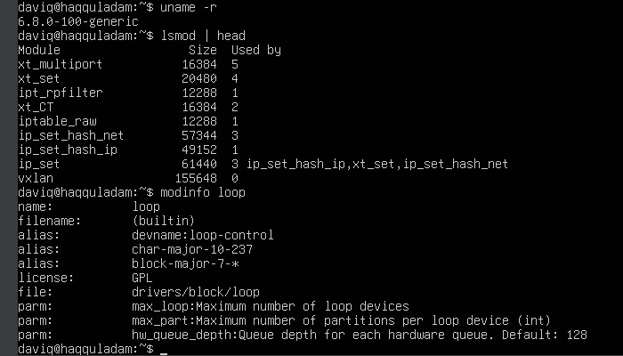

## Langkah-langkah 2.5

### 1. Lihat daftar disk/partisi (langkah keseluruhan)
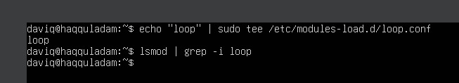

## Langkah-langkah 2.6

### 1. membedakan perangkat disk (langkah keseluruhan)
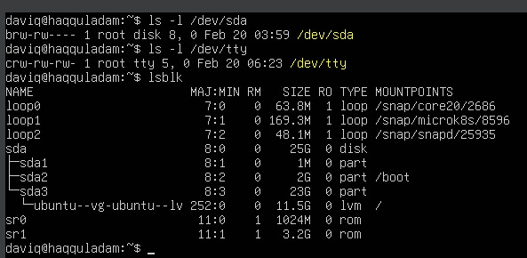

## Langkah-langkah 2.7

### 1. Cek atribut udev untuk disk (langkah keseluruhan)
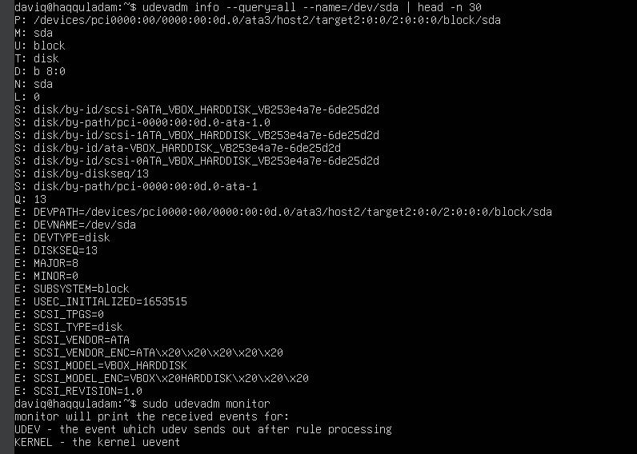